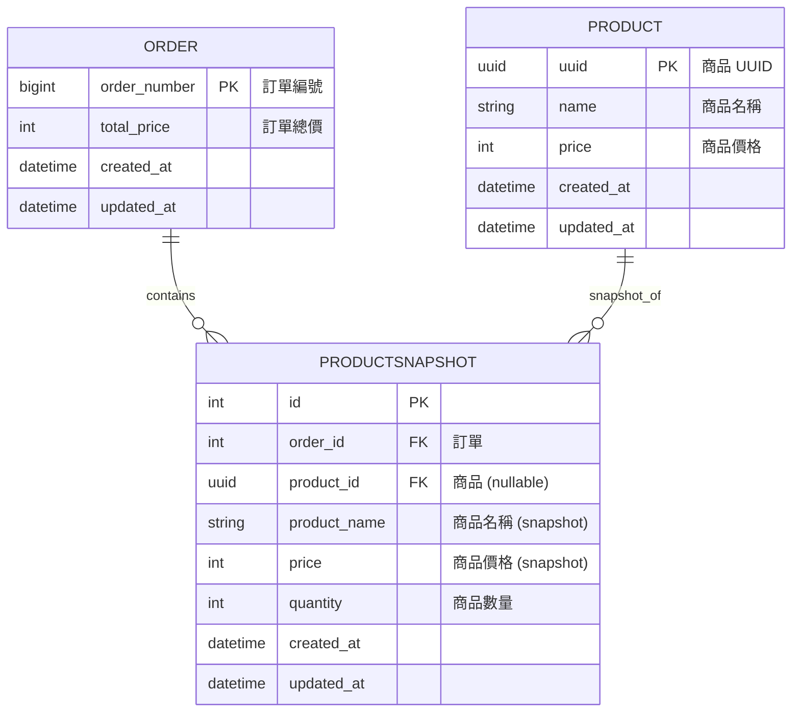

# Omni Pretest
### Project Overview

## Setup Environment
1. **Configure Environment Variables** \
   Rename the example environment file to active configuration:
   ```bash
    mv .env.example .env
    ```
2. **Start Services Launch the Docker containers:**
    ```
    docker-compose up
    ```
3. **Access the System** \
    Open your browser and navigate to: http://localhost:8008

## Unit Testing
本專案使用 Django REST Framework 的 `APITestCase` 進行單元測試，並整合 **Codecov** 與 **GitHub Actions** 進行程式碼覆蓋率 (Code Coverage) 追蹤。

[](https://codecov.io/gh/0xJasonChien/pretest)

### 測試範圍
測試代碼主要涵蓋以下核心邏輯：
- **API Endpoints**: 驗證 `import-order` 與 `import-product` 的 HTTP 狀態碼與回應資料。
- **Authentication**: 測試 Token 驗證機制（Valid vs Invalid Token）。
- **Business Logic**: 驗證資料庫是否正確建立 `Order` 與 `Product` 關聯。

### CI/CD Integration
本專案使用 GitHub Actions 進行自動化整合測試。當 Pull Request 建立或代碼 Push 至 `main` 分支時，將觸發 `ci-workflow`。

流程包含以下步驟：
1.  **Environment Setup**: 在 Ubuntu 環境下建立 Python 3.12 虛擬環境，並安裝 `requirements.txt` 依賴。
2.  **Quality Check**: 使用 **Pre-commit hooks** 自動檢查代碼格式與品質 (Linting)。
3.  **Unit Testing**: 使用 `pytest` 執行單元測試，並搭配 `--cov` 參數生成 XML 格式的覆蓋率報告。
    * *注意：CI 過程中使用 GitHub Secrets 注入測試資料庫的連線資訊 (DB_HOST, DB_USER...等)。*
4.  **Coverage Upload**: 自動將測試覆蓋率報告 (`coverage.xml`) 上傳至 **Codecov**，並更新 README 上的 Badge 狀態。

## API 說明
### 1. 匯入訂單 (Import Order)
- **Endpoint:** `POST /api/import-order/`
- **Feature:** 匯入訂單
- **Tags:** `import-order`
- **Request Body:**
  - **Content Types:** `application/json`
  - **Schema:** `CreateOrder`
    ```json
    {
      "products": [
        {
          "product": {
            "uuid": "string",
            "name": "string",
            "price": 100
          },
          "name": "string",
          "quantity": 1,
          "price": 100
        }
      ]
    }
    ```
- **Response `201`:** 成功建立
  - **Schema:** `OrderList`
    ```json
    {
      "order_number": 1,
      "total_price": 100,
      "product": [
        {
          "product": {
            "uuid": "string",
            "name": "string",
            "price": 100
          },
          "name": "string",
          "quantity": 1,
          "price": 100
        }
      ]
    }
    ```

---

### 2. 匯入商品 (Import Product)
- **Endpoint:** `POST /api/import-product/`
- **Feature:** 匯入商品
- **Tags:** `import-product`
- **Request Body:**
  - **Content Types:** `application/json`
  - **Schema:** `Product`
    ```json
    {
      "uuid": "string",
      "name": "商品名稱",
      "price": 100
    }
    ```
- **Response 201:** 成功建立
  - **Schema:** `Product`
    ```json
    {
      "uuid": "string",
      "name": "商品名稱",
      "price": 100
    }
    ```

---

### 3. 商品列表 (List Product)
- **Endpoint:** `GET /api/list-product/`
- **Feature:** 取得所有商品列表
- **Tags:** `list-product`
- **Response `200`:** 成功取得
  - **Schema:** 陣列 `Product`
    ```json
    [
      {
        "uuid": "string",
        "name": "商品名稱",
        "price": 100
      }
    ]
    ```

## 資料庫設計思路
1. **Snapshot Pattern** \
    為了防止商品後續改名或調價影響歷史訂單紀錄，採用了 Snapshot Pattern \
    即使未來 Product 被修改或刪除（設為 `SET_NULL`），使用者購買的歷史訂單的金額不會受影響，確保資料的完整性
2. **寫入效能優化** \
    在 `create_order` 的實作中，考量到批量建立訂單明細的效能:
     - **避免 N+1 Query**：不使用迴圈逐筆查詢資料庫，而是先收集所有需要的 UUID，透過 `get_product_uuid_map` 一次性撈取並轉為 Hash Map。
3. **資料庫鍵值設計策略**
     - **Product (UUID)**：對外公開的商品資源使用 UUID，避免流水號被遍歷預測，提升安全性。
     - **Order (BigAutoField)**：內部訂單使用整數流水號，在後台管理與溝通上較為直觀，且索引效能較佳。

### Database Diagram

